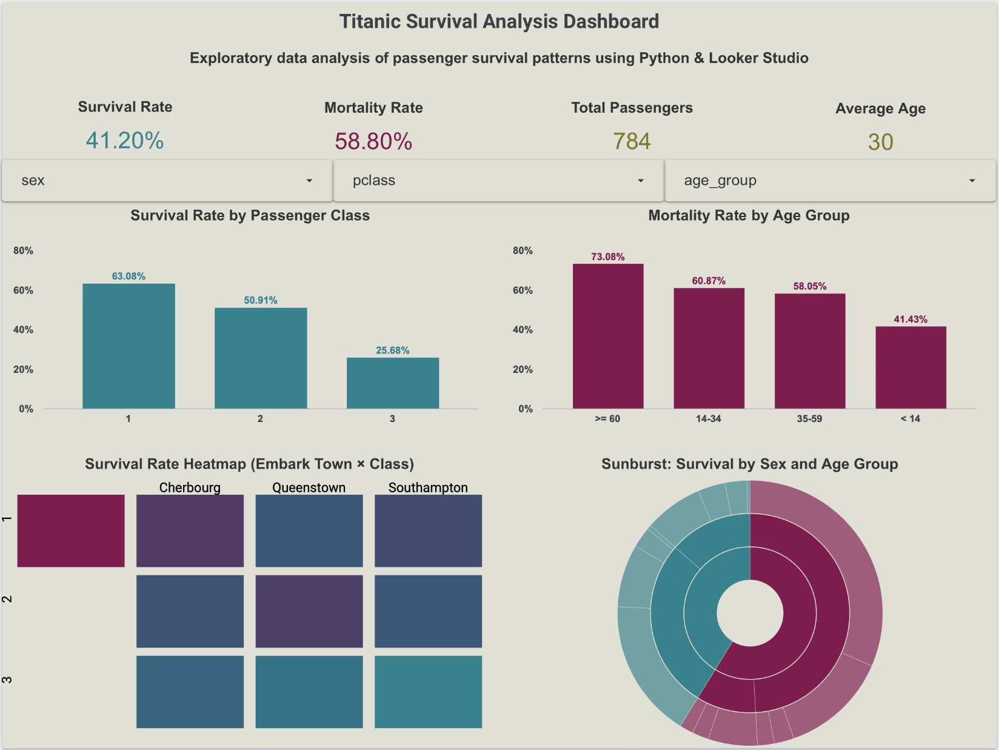

# 🚢 Titanic Survival Analysis — Exploratory Data Analysis (EDA)

This project provides an exploratory data analysis (EDA) of the Titanic dataset using Python.  
The goal is to identify key factors that influenced passenger survival and visualize meaningful patterns.

---

## 🖥️ Dashboard Preview

<p align="center">
  
</p>

---

## ⭐ Project Highlights
- Complete EDA workflow: data inspection → cleaning → feature engineering → visual exploration  
- **7 high-quality visualizations** (count plot, pie charts, heatmap, sunburst)  
- Feature engineering: `relatives_count`, age binning, categorical encoding  
- Comparative survival analysis across:
  - age groups  
  - ticket classes  
  - deck categories  
  - family size  
- Identification of the strongest mortality factors  
- Clean and structured Jupyter Notebook suitable for a professional portfolio  
- **Interactive Looker Studio dashboard with dynamic filters**

---

## 📊 Interactive Dashboard (Looker Studio)

This project includes a fully interactive BI dashboard built in **Looker Studio**.  
It allows exploration of survival patterns using filters:

- Sex  
- Passenger class  
- Age group  

Contains:
- KPI cards  
- Survival & mortality bar charts  
- Heatmap (Embark Town × Class)  
- Sunburst showing survival distribution by sex and age group  

🔗 **Dashboard link:**  
👉 *https://lookerstudio.google.com/reporting/14adafde-d88c-4d5a-9447-4663cd451a61*

---

## 📂 Repository Structure
```
titanic-eda/
│── Titanic analysis.ipynb  # Main analysis notebook
│── README.md               # Project documentation
│── requirements.txt        # Required libraries
│── visualization/          # Saved PNG visualizations
│ ├── relatives_count_distribution.png
│ ├── deaths_by_age_category.png
│ ├── deaths_by_pclass.png
│ ├── deaths_by_relatives_count.png
│ ├── deaths_by_deck.png
│ ├── titanic_sunburst.png
│ ├── survival_heatmap.png
│ ├── dashboard_preview.png
│ └──
```
---

## 🔧 Technologies Used
- Python 3  
- pandas  
- numpy  
- seaborn  
- matplotlib  
- plotly  
- Looker Studio (interactive dashboard)

---

## 📊 Key Insights

- **Age:** seniors (60+) had the highest mortality rate  
- **Ticket class:** 3rd-class passengers faced the highest fatality count  
- **Family size:** passengers traveling alone or with many relatives were less likely to survive  
- **Deck:** certain decks showed particularly high mortality  
- **Combined factors:** sex × age × survival interactions visualized using a sunburst diagram  

A heatmap also highlights survival differences by embarkation town and passenger class.

---

## 🖼 Visualization Samples

All visualizations are located in the `/visualization` directory.

---

## 🚀 How to Run the Notebook

```bash
# Clone repository
git clone <repo-url>

# Open notebook
jupyter notebook "Titanic analysis.ipynb"
```
## 📌 License
This project is for educational and portfolio purposes only.
